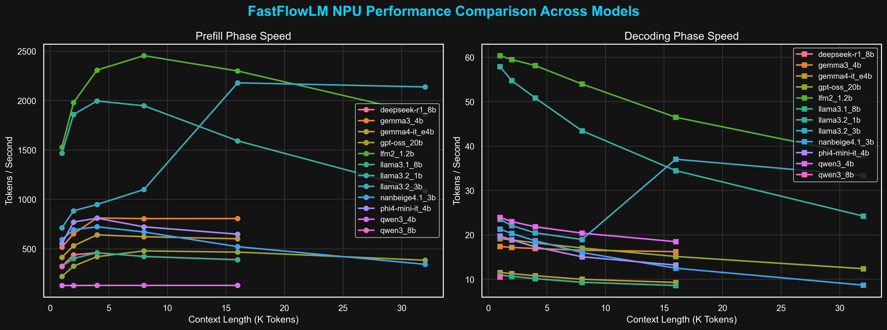

# FastFlowLM NPU Benchmarks on AMD Strix Halo

## 1. Executive Summary
This repository tracks the performance of the FastFlowLM runtime deployed on AMD's XDNA 2 Neural Processing Unit (NPU) integrated into the Ryzen AI Max+ 395 (Strix Halo) APU. Across a suite of models including LLaMA 3.1, LLaMA 3.2, Qwen 3, and DeepSeek, we highlight the unique offload capabilities of the NPU, proving its viability for low-power, persistent local AI agent execution.

## 2. Hardware & Software Environment
- **Hardware Platform:** ASUS ROG Flow Z13 GZ302EA (2-in-1 Tablet/Laptop)
- **CPU:** AMD Ryzen AI Max+ 395 (16 Cores / 32 Threads, Zen 5 Architecture)
- **NPU:** AMD XDNA 2
- **Memory Configuration:** 128 GB LPDDR5x (Unified UMA pool leveraging efficient NPU host mapping)
- **Software Stack:** Fedora 43 (KDE Plasma), FastFlowLM v0.9.40, `amdxdna` driver 0.6.0
- **Quantization Profile:** Standard NPU-optimized quantization variants (e.g., INT4/INT8 hybrid formats)

## 3. Key Findings & Performance Scaling
Our benchmarks evaluate FastFlowLM throughput across diverse model architectures spanning 1B to 20B parameters, measuring prefill and decoding phases up to 16K context lengths.

- **Consistent Decoding on NPU:** For models like LLaMA 3.1 8B and Qwen 3 8B, the NPU maintains a stable decoding phase of **9–12 tok/s**, entirely offloading the work from the CPU/GPU, freeing up thermal headroom for foreground applications.
- **Micro-Model Acceleration:** Smaller models (1B to 3B parameters) experience significantly higher prefill throughput (exceeding 400 tok/s), indicating the NPU is perfectly positioned for routing tasks and simple classification.
- **Power Efficiency:** By utilizing the XDNA 2 NPU, system wattage remains drastically lower compared to GPU Vulkan offload, making this the ideal stack for battery-powered, continuously running local AI assistants.

## 4. Sponsorship & Contact
We are actively seeking hardware and financial sponsorships to expand testing across upcoming hardware architectures, including Lunar Lake, Kraken Point, and RTX 50-series platforms.

For review requests, architecture benchmarking, and collaboration inquiries, please connect with me via LinkedIn:
**[Roland Pascua](https://www.linkedin.com/in/rolpascua/)**
